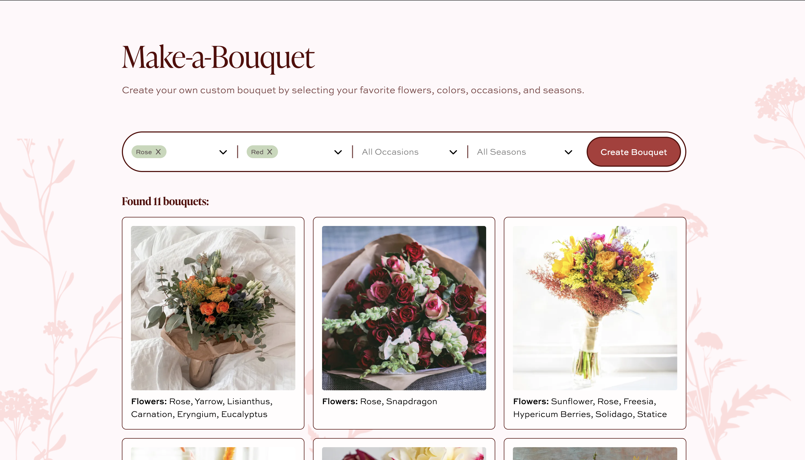

# Make-a-Bouquet

I built **Make-a-Bouquet** to make it easier to get inspiration for what kind of bouquet to create, based on flower types, colours, occasion, and season. I originally built this project because I always had a hard time picking out a bouquet to give to my girlfriend, and I wanted a better way to explore ideas beyond generic florist categories.

## Features

- **Inspiration-First Browsing**  
  Explore a large collection of bouquets designed to spark ideas rather than push predefined products.

- **Advanced Filtering**  
  Filter bouquets by flower type, color palette, and season to quickly narrow down styles that match what you’re looking for.

- **Detailed Bouquet Descriptions**  
  Each bouquet includes descriptive metadata highlighting its flowers, colors, and seasonal feel.

- **Reusable UI Components**  
  Built reusable, composable React components (e.g. dropdowns, filter controls, cards) to keep the UI consistent and scalable.

- **Clean, Aesthetic UI**  
  Designed with a minimal, visual-first layout that keeps the focus on the bouquets themselves.

## How It Works

- **Dataset Collection**  
  Started with a large, unstructured collection of bouquet images.

- **AI-Powered Image Labeling**  
  Wrote custom JavaScript scripts to run images through OpenAI to generate structured labels for flower types, colours, occasions, and seasons.

- **Image Processing & Optimization**  
  Built Node.js scripts to compress images and generate multiple resolutions for performance and responsiveness.

- **Frontend Integration**  
  The React frontend consumes the structured dataset to power filtering, descriptions, and browsing experiences.

## Tech Stack

### Frontend
- React
- TypeScript

### Backend
- Node.js
- JavaScript (server logic, data models, scripts)

### Data & Infrastructure
- AWS S3 (multi-resolution image storage)
- OpenAI (image labeling pipeline)
